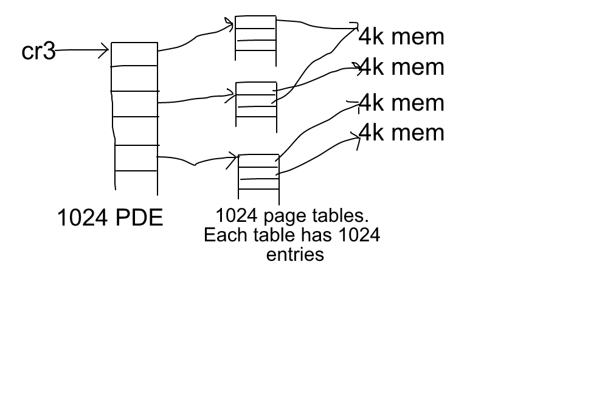

# Overview
By default, CPU uses the segment mechanism to find the pysical memory address. The formular using by segment mechanism is simple ```seg_start_address + offset```. But under segment mechanism, you only have **real memory space**. If you want to implement **virtual memory**, we need to use the **paging mechanism** for memory management. Under paging mechaism, ```seg_start_address + offset``` will get a linear address, then use **Page Directory** and **Page Table** to find the real physical address.

# Paging mechanism address transfer flow


* In the linear address, top 10 bits points to address of one PDE
* Next 10 bits points to offset in one page table
* Lower 12 bits is the offset in real pysical memory address

# Initialize paging mechanism

```asm
; Initialize PDE and PTE ( Page Directory Entry and Page Table Entry ) in protected mode, then
    mov eax, PageDirBase
    mov cr3, eax ; make cr3 points to the base address of Page Directory
    mov eax, cr0
    or eax, 80000000h
    mov cr0, eax ; enable paging mechanism
    jmp short .3 ; ??
.3:
    nop
```
